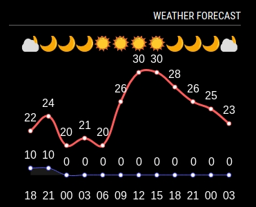

# MMM-TW-Weather

Hourly Forecast (temperature, weather icons on the top, chance of rain on the bottom) of Taiwan City



MagicMirror module for displaying weather forecasts from [Taiwan Central Weather Bureau](https://www.cwb.gov.tw/eng/). Weather forecasts are displayed by using [Chart.js](https://www.chartjs.org/), an open-source free library for drawing charts.

This module can work with free opendata API, which only requires to sign up and get an API key from [Open Weather Data](https://opendata.cwb.gov.tw/index).

## Installation

Clone this repository and place it on MagicMirror module directory.

```
$ cd ~/MagicMirror/modules
$ git clone https://github.com/jungleson/MMM-TW-Weather.git
```

or if you want to use an old version, clone it with the version.
```
$ cd ~/MagicMirror/modules
$ git clone -b <version> https://github.com/jungleson/MMM-TW-Weather.git
```

## Configuration

### Configuration Example

```
   modules: [
        {
            module: "MMM-TW-Weather",
            header: "Taiwan Weather Forecast",
            position: "top_right",
            config: {
                apiKey: "<your-opendata-api_key>",
                dataid: "F-D0047-053",
                locationName: "東區",
                dataNum: 12,
                height: "250px",
                width: "350px",
            }
        }
   ]
```

### Configuration Options

| Options | Required | Default | Description |
|:--------|:--------:|:--------|:------------|
| apiKey | yes | | API key to call [Opendata](https://opendata.cwb.gov.tw/) API. You can get the API key by signing up [Opendata]([https://openweathermap.org](https://opendata.cwb.gov.tw/). |
| dataid | yes | `F-D0047-053` | ID of the Taiwan city |
| locationid | yes | `東區` | Taiwan District name |
| title | | `Weather Forecast` | Title of the chart to display |
| height | | `300px` | Height of the chart area in px |
| width | | `500px` | Width of the chart area in px |


